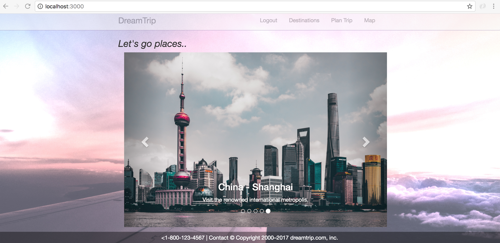
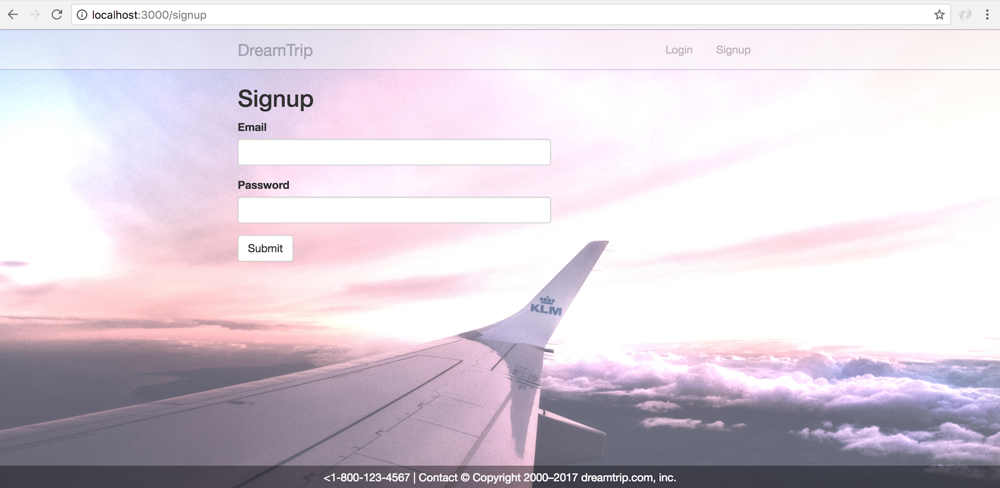

Project 01: DreamTrip
===================

**DreamTrip** is a planning and organizing web based application for your traveling needs.

----------

----------

----------

Team
-------------------

**Sherry Cheng** - https://github.com/sgc88

**Pengfei Ye** - https://github.com/pengfeiye

----------

Technologies
-------------------
  * HTML
  * javaScript
  * jQuery
  * CSS
  * Bootstrap
  * MongoDB
  * Mongoose
  * Passportjs
  * Nodejs
  * Expressjs
  * Ejs templating

----------

  
Existing Features
-------------------
* User Authentication.
* Users can show, create, update, and delete "destinations/plans".
* Users can only see destinations that they have created.
* Users can use Google map to search for places for reference.

----------

Planned Features
-------------------
* Be able to share destinations between users.
* Integrate Google maps API locations/markers into a destination's plans.

